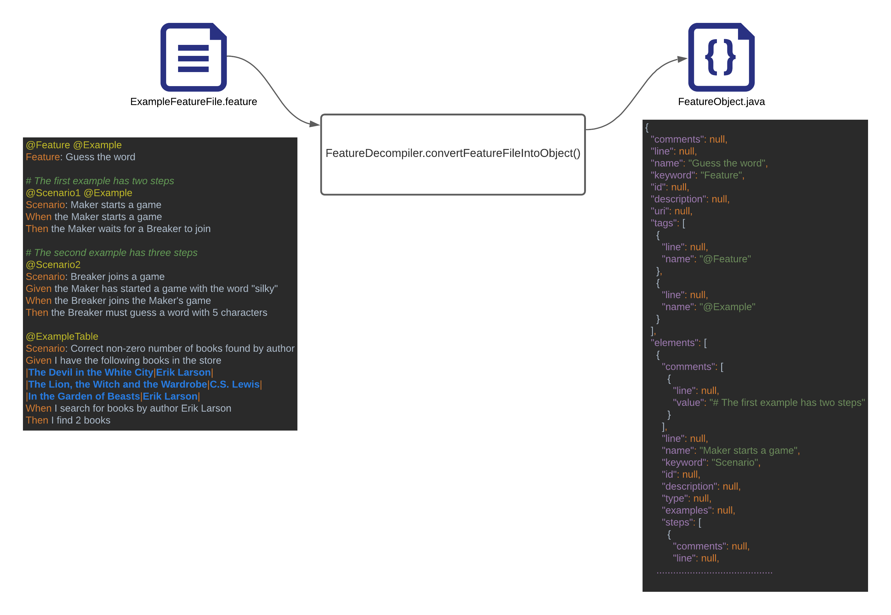
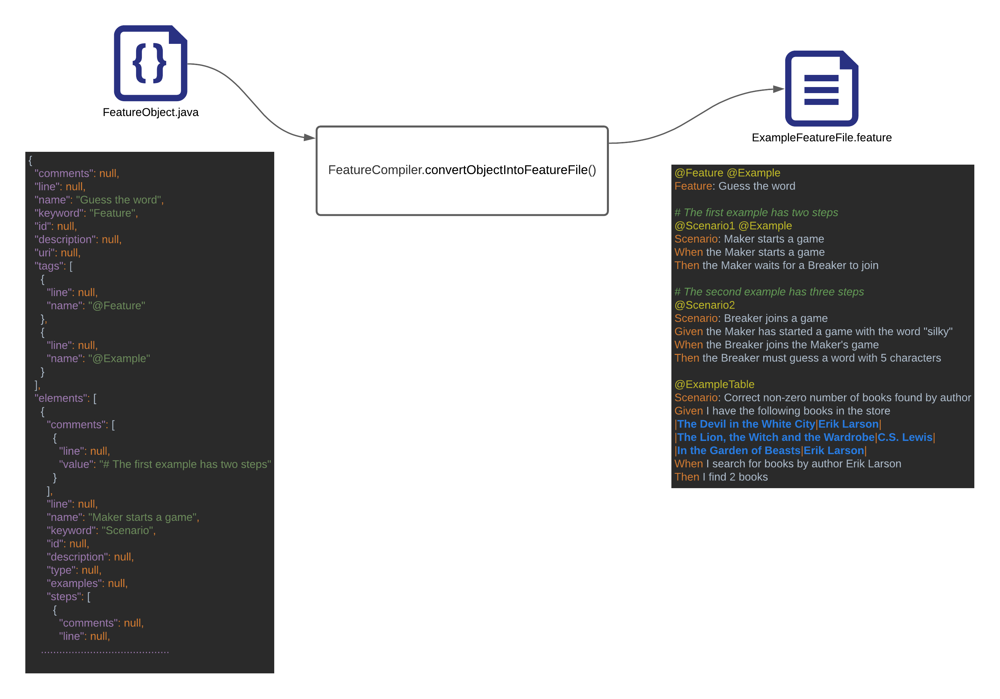

<h1>Feature Alchemist</h1>

<h2>Purpose</h2>
<p>
The purpose of this project was to create a tool that could deserialize a Cucumber .feature file into a format which 
would be easier to consume by other tools which would perform a series of validation and modification to the 
deserialized feature object before finally re-serializing the object back into a .feature file.
</p>

<h2>Background</h2>
<p>
At work there was an idea that to rely more on cucumber tags to provide testing targeted at more specific areas of 
functionality. To support this several tools were conceived that could validate tags were being used, could modify 
tags, and could gather tags for reporting purposes. Each of the considered tools would require some tool that could 
first deserialize a .feature file into something easier for the tools to work with.
</p>

<p>
Gherkin already provided a tool that could deserialize an .feature file into a POJO. However, once the modifications 
were performed we needed a way to re-serialize the POJO back into a .feature file.
</p>

<p>
However due to resources and low priority the project never really got going. However, I was interested in making a 
proof-of-concept (POC) for how the tool could look in my spare time. As the project was cancelled, I didn’t have much 
enthusiasm to continue, especially as I became interested in other projects. Since it was done in my spare time I 
created this repo so as not to lose the work.
</p>

<h2>Deserialization</h2>
<p>
Deserialization, in the context of the feature alchemist is the process in which a .feature file I converted 
into a POJO. Luckily Gherkin have released a tool which performs this process.
</p>


<p>
As you can see from the above the .feature file diagram has been deserialized into a java representation as you’d 
expect, with a overarching Feature object representing the feature, a Scenario object representing the features 
various scenarios and so forth.
</p>
<p>
Its worth mentioning that while this deserialization tool provided by Gherkin is extremely useful it does have its 
limitations. While .feature files can be very loose with syntax the deserialize does mandate a specific order to the 
elements in the feature in order to correctly map the .feature file into a POJO. This results in completely valid 
Cucumber syntax like the below causing the deserialize method to throw an exception.
</p>

```
Feature: Be a valid feature
@UUID-e28c835c-374c-4a96-b2c1-e06c1f30fb2e
Scenario Outline: Some scenario
Given a precondition
When some event
Then i validate the result
And i validate another result
And i validate another result
Examples:
| row |
| column |
@SomeTag
Example:
| row |
```
```
Error mapping .feature file json into Feature object
```

<h2>Serialization</h2>
<p>
Serialization is the process in the context of the feature alchemist is the process in which a plain old java object 
(POJO) is converted into a .feature file.
</p>


<p>
The serialization process would be necessary in case we wanted to save any modifications to .feature files through 
proposed tools like the tag-cleaner. Unfortunately, unlike deserialization Gherkin does not provide a tool 
for the serialization process. 
</p>
<p>
The serialization process takes a Java object representing a .feature file (this will almost always be created 
from the de-serialization process) and uses it to write to a new .feature file. Each Cucumber element has 
its own logic for how it should be written to a file.
</p>

<h2>Validation</h2>
<p>
Before a feature can be serialized it must first be validated to confirm the resulting. feature file can be successfully 
used for testing. Like serialization each Cucumber element contains a Validator used to validate the object 
for invalid syntax.
</p>
Validator rules can be split into warnings and errors. Validation warnings are considered bad practice but do not 
prevent a Cucumber file from running. Warnings include a feature without a description or any scenarios. However, 
a validation error means that the resulting .feature file would contain invalid syntax. Examples of validation errors 
include missing keywords or background scenarios with example tables.
<p>
A Feature object containing only validation warnings will be allowed to compile. However, a feature object containing 
validation errors will be prevented from compiling, and an exception will be thrown indicating
the validation errors encountered.
</p>

```
{
  "valid": false,
  "validationErrors": [
    {
      "severity": "ERROR",
      "validationError": "Feature has no keyword",
      "elementIdentifier": null
    },
    {
      "severity": "ERROR",
      "validationError": "Step has no keyword",
      "elementIdentifier": "I search for books by author Erik Larson"
    },
    {
      "severity": "ERROR",
      "validationError": "Step has no keyword",
      "elementIdentifier": "I find 2 books"
    }
  ]
}
```

<h2>How to use</h2>
<p>To decompile .feature files into a Feature object:</p>

```
  FeatureDecompiler featureDecompiler = new FeatureDecompiler();
  Feature feature = featureDecompiler.convertFeatureFileIntoObject(file);
```
<p>To re-compile Feature objects back into Feature files:</p>

```
 FeatureCompiler featureCompiler = new FeatureCompiler();
 featureCompiler.convertObjectIntoFeatureFile(feature, new File("newFeature.feature"));
```

<h2>Improvements</h2>
As mentioned above this project was a proof-of-concept and some logic like the feature object validation necessitating
the use of tags in scenarios reflects some business rules from the original design document. As such there are some
things that could be improved. I don't anticipate returning to this project soon, but here are some things in case
future me is interested.
<ul>
    <li>More unit tests around feature serialization</li>
    <li>Refactoring the "Builder" classes to not use on static methods
    <ul>
      <li>A single class responsible for building the various methods</li>
      <li>Create a "Serializable" interface (though that specific name is taken) and implement 
         it in the various model classes like Feature, Scenario.
      </li>
      <li>Keep the multiple "Builder" classes but remove the static keyword, as per my general dislike of static methods</li>
    </ul>
    </li>
    <li>Greater configurability of validation, allow the client to construct a custom validation object to use during serialization</li>
</ul>
